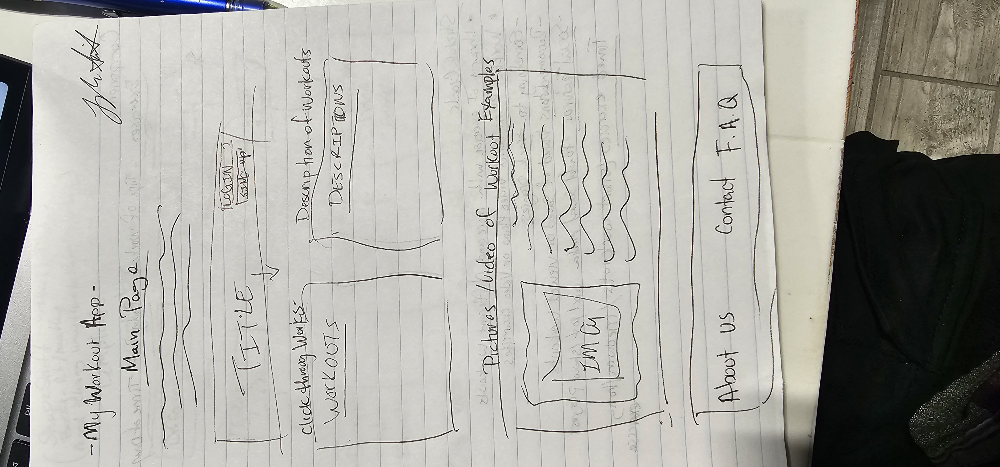
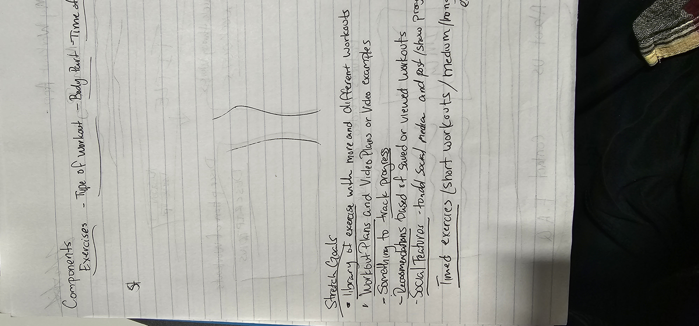
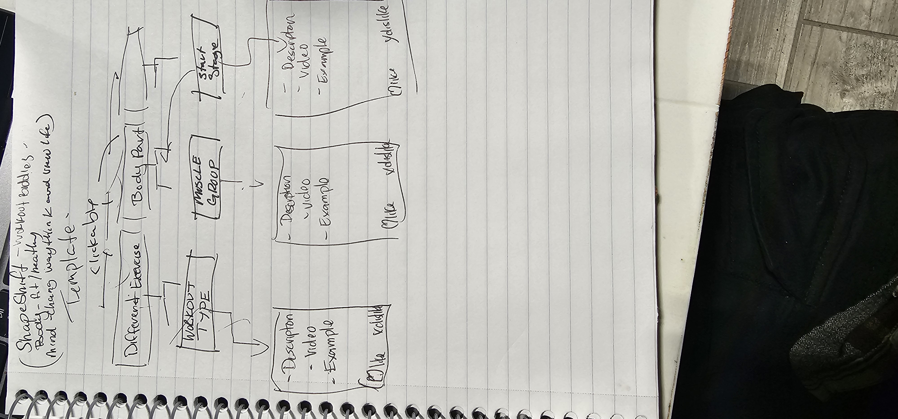

## SOLO-EXERCISE-APP

# -ShapeShifters-

# Description:
    This app was created for individuals who want to go to the gym but a lot of times do not know what to do and don't wanna look crazy just doing what they see others doing or making things up. sometimes this can be the main hindrance in people even going to the gym. With shapeShifters we provide many workouts and exercises for all type of gym goers or even those that want to workout at home we have all types of workouts.

# to Install and Run the Project

This project was created with [Create React App](https://github.com/facebook/create-react-app).
Install the dependencies: npm install

Start the application: npm start

the application will run on: https://my-solo-project-workingout.onrender.com

# To Use the Project
    The app itslef is pretty simple to understand and use by design sometimes the motivation going to the gym is a lot of just beliveing that its alll hard or you have to do hrs and hrs a day everyday but this app will show that you dont have to do the extreme to be fit and start your exercise/workout Journey. we only have three buttons to get started depending where you are in your journey you click the appropriate button and start your Shape Shifting journey.

 # WireFrames 
 
 
 
